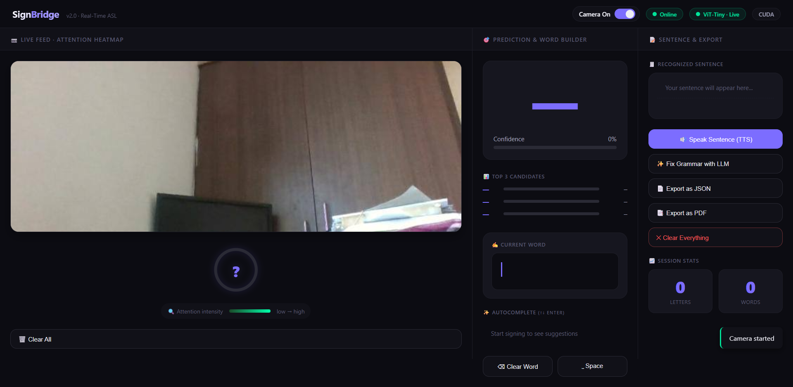

# SignBridge — Real-Time ASL Fingerspelling Interpreter


---

## Why I Built This

I kept thinking about a simple situation: a deaf person walks up to a hospital counter, a police station, or a customer service desk — and there's no interpreter. The staff don't know sign language. The person has to write things down, use gestures, or wait. That gap exists everywhere, every day.

SignBridge started as my attempt to bridge that gap with a laptop webcam. No special hardware. No interpreter required. Just sign, and the system reads it.

I also wanted to build something that goes beyond a notebook demo — a full pipeline from webcam to spoken sentence, with real UI, real architecture decisions, and real limitations I could honestly talk about.

---

## What It Does

- Reads ASL fingerspelling (A–Z + space + delete) in real time from a webcam
- Converts recognised letters into words and sentences
- Speaks the sentence aloud via text-to-speech (offline, no API needed)
- Corrects ASL grammar to natural English using Llama 3.2 (running locally via Ollama)
- Shows which hand landmarks drove each prediction (attention heatmap)
- Exports the session transcript as JSON or PDF
- Works as a PWA — installable on desktop without a browser tab

---

## Real-World Use Cases

These aren't hypothetical. Each of these is a gap that exists right now:

**Hospitals and public counters** — A hearing staff member with no ASL knowledge can point a laptop at someone fingerspelling. SignBridge converts it to text or speech in real time. No interpreter, no delay.

**ASL learning** — Someone learning fingerspelling can practice in front of their webcam and get instant feedback. The confidence score tells them how clearly they're signing each letter. The attention heatmap shows which parts of the handshape the model actually looks at — useful for understanding what makes a letter recognisable.

**Emergency kiosks** — A public terminal at a train station or embassy could run SignBridge. A deaf person spells out "help" or "medical" and the system displays or speaks it to nearby staff.

**Video calls** — Integrated as a virtual camera overlay, it could caption fingerspelling in real-time during remote meetings.

**Alternative input for mobility-impaired users** — The hold-to-confirm mechanism makes it robust enough for command input. Spell a letter and hold it to trigger an action — usable for gaming, navigation, or any hands-free interface.

**Edge and wearable deployment** — The v2 architecture runs on 63 numbers (landmark coordinates), not raw video. That's lightweight enough for smart glasses, phones, or a Raspberry Pi kiosk.

---

## The Two Versions

### v1.0 — November 2025

The first version was straightforward: webcam frame → MediaPipe bounding box → crop the hand region → MobileNetV2 classifies the image patch → letter displayed.

It worked. On a clean white background with good lighting, it was hitting letters correctly. But I ran into two problems immediately when I used it in my actual room.

**Problem 1 — The model was reading the background.** MobileNetV2 classifies image patches. That means it sees the wall, the shelf, the lighting — not just the hand. The dataset it was trained on used clean white studio backgrounds. My room doesn't look like that. The model had no way to generalise.

**Problem 2 — Single frames flicker.** Any frame where the hand moves mid-sign gets a wrong prediction. Without temporal smoothing, the letter display jumps constantly and you can't reliably confirm a letter.

The 99.8% validation accuracy looked great on paper. Real-world use told a different story. That's not a failure — that's how you learn what to fix.

### v2.0 — June 2026

Rebuilt from scratch with both problems as the starting point.

The key architectural change: stop feeding image patches to a CNN. MediaPipe already gives 21 precise 3D landmarks per hand — 63 numbers describing exactly where each finger joint is. Feed those to a transformer instead. The background becomes completely irrelevant. Lighting becomes irrelevant. Camera quality becomes less of a factor. The model learns hand geometry, not pixel patterns.

A 15-frame BiLSTM window on top adds temporal memory and eliminates the flickering entirely. 15 frames of consistent landmark positions before a letter is confirmed — no more mid-movement false predictions.

Everything else — word engine, autocomplete, LLM correction, TTS, export, attention heatmap — was added to make it usable as an actual tool rather than a classifier demo.

---

## Screenshots

### v2.0 — June 2026

| Dashboard | D Prediction |
|---|---|
|  |  |

| O Prediction | R Prediction |
|---|---|
|  |  |

| W Prediction | Word Formation |
|---|---|
|  |  |

| Camera Feed + Landmarks |
|---|
|  |

### v1.0 — November 2025

| Dashboard | C Detection | V Detection |
|---|---|---|
|  |  |  |

| Training Run | Misidentification (known limitation) |
|---|---|
|  |  |

---

## Architecture

### v1 — MobileNetV2 on image patches
```
Webcam frame
    → MediaPipe (hand bounding box only)
    → Crop + resize to 128×128
    → MobileNetV2 (fine-tuned, ImageNet weights)
    → Softmax → letter + confidence
    → HTTP polling to frontend
```

### v2 — ViT-Tiny + BiLSTM on landmarks
```
Webcam frame
    → MediaPipe (21 landmarks × x,y,z = 63 values)
    → Rolling 15-frame buffer
    → ViT-Tiny (each landmark = one token, positional encoding encodes hand topology)
    → Bidirectional LSTM (temporal smoothing across 15 frames)
    → Softmax → letter + confidence + per-landmark attention weights
    → WebSocket emit to frontend
    → Hold-to-confirm (18 stable frames) → word engine → sentence
    → LLM correction (Llama 3.2 via Ollama, offline)
    → TTS (pyttsx3, offline)
```

---

## Model Comparison

| | v1 | v2 |
|---|---|---|
| Architecture | MobileNetV2 | ViT-Tiny + BiLSTM |
| Input | 128×128 image crop | 63 landmark coords × 15 frames |
| Classes | 29 (A–Z + space + del + nothing) | 29 |
| Val Accuracy | 99.8% (dataset) | ~95%+ (dataset) |
| Real-world accuracy | Drops with cluttered bg / low light | Background/lighting invariant |
| Inference transport | HTTP polling | WebSocket streaming |
| Explainability | None | Per-landmark attention heatmap |

---

## Dataset

ASL Alphabet — Kaggle (87,000 images, 29 classes)
👉 https://www.kaggle.com/datasets/grassknoted/asl-alphabet

```
data/asl_alphabet/asl_alphabet_train/
    A/ B/ C/ ... Z/ del/ nothing/ space/
```

---

## Running v1

```bash
cd version-1
python -m venv venv && venv\Scripts\activate
pip install torch==2.7.1+cu118 torchvision==0.22.1+cu118 --index-url https://download.pytorch.org/whl/cu118
pip install -r backend/requirements.txt

python model/train.py        # ~10 min on RTX 3050, achieved 99.8% val acc
python backend/app.py        # http://localhost:5004
```

## Running v2

```bash
cd version-2
python -m venv venv && venv\Scripts\activate
pip install -r backend/requirements.txt

ollama pull llama3.2:3b      # one-time download
ollama serve                 # keep running in a separate terminal

python model/train_v2.py     # builds landmark cache + trains (~15–20 min)
python backend/app.py        # http://localhost:5004
```

---

## Project Structure

```
sign_language_translator/
├── version-1/
│   ├── backend/
│   │   ├── app.py              # Flask HTTP server
│   │   ├── predictor.py        # MobileNetV2 inference + MediaPipe
│   │   └── requirements.txt
│   ├── model/
│   │   └── train.py            # MobileNetV2 fine-tuning
│   ├── data/
│   │   └── asl_alphabet/       # Kaggle dataset
│   └── frontend/
│       └── index.html
├── version-2/
│   ├── backend/
│   │   ├── app.py              # Flask + Socket.IO + REST API
│   │   ├── predictor_v2.py     # ViT-Tiny + BiLSTM + attention heatmap
│   │   ├── word_engine.py      # Letter buffer + autocomplete + sentence builder
│   │   └── requirements.txt
│   ├── model/
│   │   └── train_v2.py         # ViT-Tiny + BiLSTM training on landmark sequences
│   └── frontend/
│       ├── index.html          # Full dashboard + PWA
│       └── manifest.json
├── screenshots/
├── README.md
└── ROADMAP.md
```

---

## Stack

`Python 3.10` `PyTorch 2.7` `MediaPipe` `Flask` `Socket.IO` `OpenCV` `pyttsx3` `Ollama` `Llama 3.2` `reportlab` `pyspellchecker` `Chart.js`

---

## Honest Limitations

The dataset used — ASL Alphabet on Kaggle — was recorded in studio conditions with clean white backgrounds and consistent lighting. That's the primary gap between the numbers (99.8% val accuracy on v1, ~95% on v2) and real-world performance.

v2 is significantly better because landmark coordinates are background-agnostic. But the model has never seen real video sequences — it was trained on noise-augmented single frames assembled into synthetic temporal sequences. That's a practical workaround, not a real solution. A proper video dataset would close that gap further.

The fine-tuning path (collect 50–100 frames of your own hand per letter, fine-tune the last layers) brings real-world accuracy to 85–95% for a specific user. That's the next concrete step. See ROADMAP.md.

---

## Why This Matters as a Project

The gap this addresses — real-time ASL interpretation without an interpreter — is real and unsolved at the consumer level. Professional interpreter services exist but are expensive, require scheduling, and aren't available in spontaneous situations.

What's been built here is a full pipeline: webcam → landmark extraction → transformer classification → temporal smoothing → word formation → LLM grammar correction → speech output. Each component was a deliberate choice. The architecture decisions (why landmarks over image patches, why BiLSTM over a simple RNN, why hold-to-confirm over raw frame output) are documented and defensible.

The limitations are known and the path forward is clear. That's not a weakness — that's engineering.

---

*v1.0 built: November 2025 · v2.0 rebuilt: June 2026*